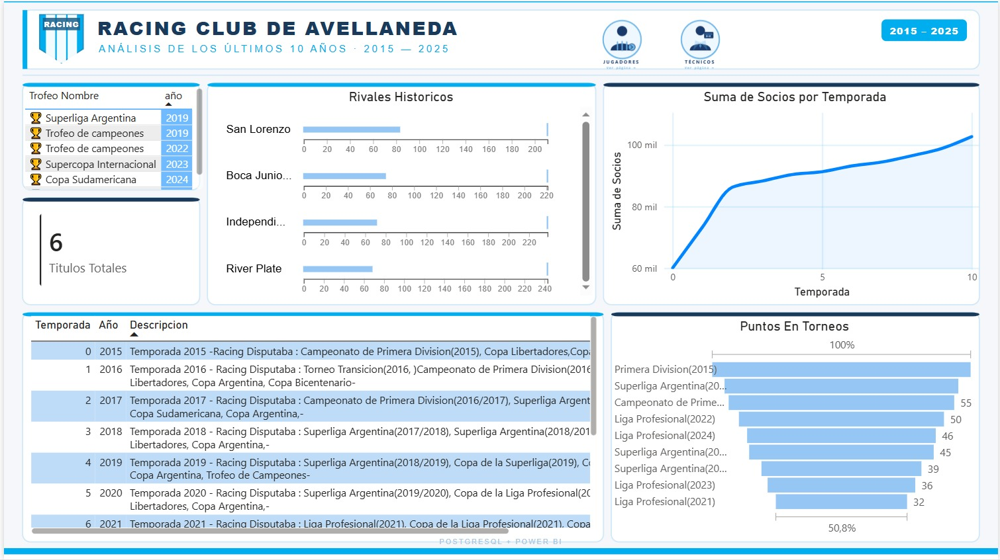
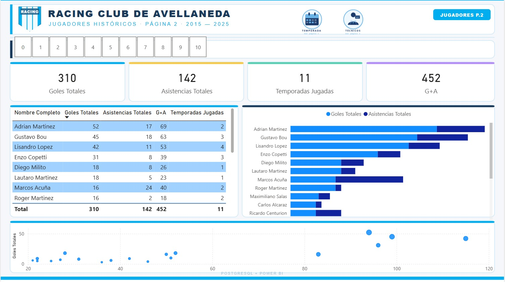

# 🏆 Racing Club de Avellaneda — Análisis Histórico 2015–2025

Dashboard interactivo desarrollado en **Power BI** con datos almacenados en **PostgreSQL**, que analiza el rendimiento deportivo del Racing Club de Avellaneda durante los últimos 10 años.

---

## 📊 Páginas del Dashboard

### 1. Temporadas
Análisis por temporada del club entre 2015 y 2025.
- Títulos obtenidos (6 en total): Superliga Argentina, Trofeo de Campeones(x2), Supercopa Internacional, Copa Sudamericana
- Rivales históricos 
- Evolución de socios por temporada
- Puntos obtenidos por torneo

### 2. Jugadores
Estadísticas de los jugadores más destacados.
- Goles totales, asistencias y G+A por jugador
- Ranking de rendimiento individual
- Goles por temporada
- KPIs: 310 goles · 142 asistencias · 452 G+A

### 3. Técnicos
Desempeño de los cuerpos técnicos que dirigieron al club.
- Partidos dirigidos, ganados, empatados y perdidos por DT
- Efectividad porcentual por técnico
- Línea de tiempo de mandatos
- Gráfico radar comparativo entre DT

---

## 🛠️ Tecnologías utilizadas

| Herramienta | Uso |
|---|---|
| Power BI Desktop | Visualización y modelado |
| PostgreSQL | Base de datos fuente |
| DAX | Medidas y KPIs |

---

## 📁 Estructura del repositorio

```
📦 Racing_Club_PowerBi/
├── 📊 Racing_Club_2015_2025.pbix
├── 🖼️ Temporada.jpeg
├── 🖼️ Jugadores.jpeg
├── 🖼️ Tecnicos.jpeg
└── 📄 README.md
```

---

## 📸 Capturas

### Temporadas


### Jugadores


### Técnicos


---

## 🚀 ¿Cómo usar este proyecto?

1. Cloná o descargá el repositorio
2. Abrí el archivo `.pbix` con **Power BI Desktop**
3. Configurá la conexión a tu instancia de PostgreSQL (o usá los datos de muestra)
4. ¡Explorá el dashboard!

---


⚽ *Datos relevados entre 2015 y 2025 — Proyecto personal de análisis deportivo*
